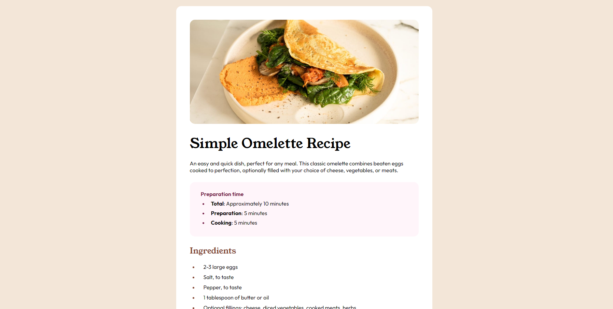

# Frontend Mentor - Recipe page solution

This is a solution to the [Recipe page challenge on Frontend Mentor](https://www.frontendmentor.io/challenges/recipe-page-KiTsR8QQKm). Frontend Mentor challenges help you improve your coding skills by building realistic projects. 

## Table of contents

- [Overview](#overview)
  - [Screenshot](#screenshot)
  - [Links](#links)
- [My process](#my-process)
  - [Built with](#built-with)
  - [What I learned](#what-i-learned)
  - [Continued development](#continued-development)
  - [Useful resources](#useful-resources)
- [Author](#author)

## Overview

### Screenshot

### Links

- Solution URL: [Add solution URL here](https://github.com/ToprakPehleeone/recipe-page-main)
- Live Site URL: [Add live site URL here](https://toprakpehleeone.github.io/recipe-page-main/)

## My process

### Built with

- Semantic HTML5 markup
- CSS custom properties

### What I learned

Using Tables and media queries for the first time. 

To see how you can add code snippets, see below:

### Continued development

I want to focus a bit more on media queries. I am sure there is a lot more useful properities to discover

### Useful resources

- [Example resource 1](https://www.w3schools.com/css/css3_mediaqueries_ex.asp) - This helped me to understand media queries. I really liked this pattern and will use it going forward.
- [Example resource 2](https://stackoverflow.com/questions/21369843/is-there-a-way-to-make-numbers-in-an-ordered-list-bold) - This is an amazing article which helped me to understand how to design <li> items. I'd recommend it to anyone still learning this concept.

## Author

- Website - [Toprak Pehlivan](https://github.com/ToprakPehleeone)
- Frontend Mentor - [@ToprakPehleeone](https://www.frontendmentor.io/profile/ToprakPehleeone)
- Twitter - [@ToprakPehlivan](https://x.com/ToprakPehlivan)

